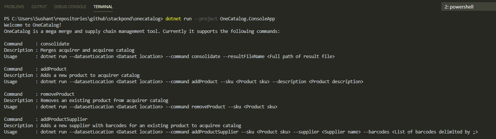

# OneCatalog

OneCatalog is a mega merge and supply chain management tool. 

It involves two parties - **Acquirer** (company which is acquiring another company) and **Acquiree** (company that is being acquired). 

Both the companies sell some common products, sourced from suppliers (sometimes the same supplier, sometimes a different one). 

This tool consolidates the product catalog into one superset (merged catalog). It also takes care of usual business tasks like managing products and suppliers.

## Requirements

- Acquirer and Acquiree could have conflicting product codes (SKUs).
- Product codes might be same, but they are different products.
- Product codes are different, but they are same product.
- Products have associated suppliers, each supplier provides 1 or many barcodes for a product.
- A product may have many suppliers.
- Application should be able to accept above data as csv files from input folder and must produce a merged catalog as a csv file in output folder.
- All products from both companies should get merged into a common catalog.
- There should not be duplicate product records in merged catalog.
- Product on merged catalog must have information about the company it belongs to originally.
- If any supplier barcode matches for one product of Acquirer with Acquiree then we can consider that those products as the same.
- Aplication should be able to add a new product to Acquirer catalog.
- Aplication should be able to remove an existing product from Acquirer catalog.
- Aplication should be able to add a new supplier with set of barcodes to Acquiree catalog.

## Sample Datasets

Please refer input folder for following CSVs:
1. [catalogA.csv](Datasets/input/catalogA.csv) - Products for Acquirer
1. [catalogB.csv](Datasets/input/catalogB.csv) - Products for Acquiree
1. [suppliersA.csv](Datasets/input/suppliersA.csv) - List of suppliers for Acquirer
1. [suppliersB.csv](Datasets/input/suppliersB.csv) - List of suppliers for Acquiree
1. [barcodesA.csv](Datasets/input/barcodesA.csv) - Product barcodes provided by supplier for Acquirer
1. [barcodesB.csv](Datasets/input/barcodesB.csv) - Product barcodes provided by supplier for Acquiree
1. [result_output.csv](Datasets/output/result_output.csv) - The correct results based on the above sample data

## Software Prerequisites

|Software|Mandatory|Download Link
|---|---|---|
|.NET Core 5.0.102|Yes|https://dotnet.microsoft.com/download|

## Build

`dotnet build`

## Test

`dotnet test`

## Run

Everything in the application is controlled by command line. 

Type `dotnet run --project OneCatalog.ConsoleApp` (as shown below) to list out all the valid commands and their options

> Its very important to note that the dataset for Acquirer and Acquiree must be in the same location and named the same way as mentioned in **Sample Datasets** section. This location must be specified in the `--datasetLocation` command line option. Refer few examples below.

#### Merge Acquirer and Acquiree product catalog into one super catalog using `consolidate`

 `dotnet run --project OneCatalog.ConsoleApp --datasetLocation "./Datasets/input" --command consolidate --resultFileName "result_output.csv"`

#### Add a new product to Acquirer catalog using `addProduct`

 `dotnet run --project OneCatalog.ConsoleApp --datasetLocation "./Datasets/input" --command addProduct --sku "9090-103-890" --description "Cheese cake"`

#### Remove an existing product from Acquirer using `removeProduct`

 `dotnet run --project OneCatalog.ConsoleApp --datasetLocation "./Datasets/input" --command removeProduct --sku "650-epd-782"`

#### Add a new product supplier to Acquiree using `addProductSupplier`

 `dotnet run --project OneCatalog.ConsoleApp --datasetLocation "./Datasets/input" --command addProductSupplier --sku "999-eol-949" --supplier "TestSupplier" --barcodes "1234;34567;8989-7896"`
